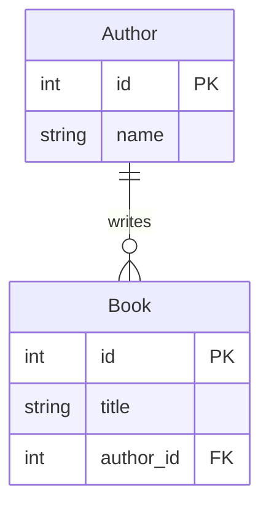

You've been asking questions and building a mental model of Rare. The problem with a mental model is that it lives in your head. When you close your laptop, it starts fading. When a new developer joins the team next month, they start from zero.

> **Devon sends you a message on Slack.**
>
> > **Devon** 10:22 AM
> > We don't have a real architecture doc. Previous dev never wrote one. If you put something together while you're learning the codebase, the whole team benefits.
>
> He's right, you would have benefitted from this. But you can tackle this easily with the help of Claude. You just learned a lot about the codebase in the last chapter. Now all you need to do is document what you learned. 

Let's start with what Devon asked for and keep going. In this chapter, you'll create four artifacts and commit them to the repo where the whole team can use them.

## Where artifacts live

Create a `docs/` directory inside `rare-api/`. This is where your API-side documentation goes. You'll also create one in `rare-client/` for the getting-started guide.

```
rare-api/
└── docs/
    ├── architecture.md         ← Exercise 3.2
    ├── schema.md               ← Exercise 3.3
    └── create-post-sequence.md ← Exercise 3.4

rare-client/
└── docs/
    └── getting-started.md      ← Exercise 3.5
```

These are real files that get committed. They're documentation for the team, not notes for yourself.

## Mermaid diagrams

Three of these artifacts are **Mermaid** diagrams. Mermaid is a text-based diagramming syntax you write inside a markdown code fence. GitHub renders it as a visual diagram automatically. A small example:



To preview Mermaid diagrams locally in VSCode, install the [Markdown Preview Mermaid Support](https://marketplace.visualstudio.com/items?itemName=bierner.markdown-mermaid) extension. Then open any `.md` file and use `Cmd+Shift+V` (or `Ctrl+Shift+V`) to see the rendered diagram.

You don't need to learn Mermaid syntax. Claude Code will generate it. You just need to be able to read the output and verify it.

## Exercise 3.2: Architecture diagram

Devon asked for this one directly. Prompt Claude Code to produce a Mermaid diagram in `rare-api/docs/architecture.md` showing Rare's system architecture: the major components, what each one is, and how they communicate. You already know the answer from Exercise 3.1, so you'll be able to tell quickly whether Claude got it right.

## Exercise 3.3: Schema diagram

Prompt Claude Code to produce a Mermaid ER diagram in `rare-api/docs/schema.md` showing every model in the codebase, its fields, and the relationships between them. Make sure your prompt tells Claude to read the actual model files, not guess at what they contain.

## Exercise 3.4: Sequence diagram for "create a post"

This is the request-flow question from Exercise 3.1, turned into a committed artifact. Prompt Claude Code to produce a Mermaid sequence diagram in `rare-api/docs/create-post-sequence.md` tracing the full "user creates a new post" flow, from the button click in the React client through to the database write.

A few things your diagram should capture if Claude got the trace right:

- The component loads categories on mount. That's a separate API call before the user even fills out the form.
- The auth token gets attached by `api.js`, not by the component or the manager. You won't see it in `PostCreate.js`.
- If the user attached an image, there's a second API call after the post is created. Two HTTP requests, not one.
- The `approved` field is set in the view based on `request.user.is_staff`. Staff posts auto-publish; non-staff posts enter a moderation queue. That logic lives in the view function, not the model.

## Exercise 3.5: Getting-started guide

You went through the pain of getting Rare running locally in Module II. No docs existed. Now write the docs that *should* have existed.

Prompt Claude Code to help you create `rare-client/docs/getting-started.md` for the next developer who joins the team after you. It should cover prerequisites, database setup, API setup, seeding, starting both servers, and login credentials.

You did all of this in Module II. Bring your own experience to the prompt. You know which steps were obvious and which weren't. The guide is better when it includes those details.

You'll verify and commit all four artifacts after the next chapter.

Next chapter: how to check whether Claude got these right before you commit them.

## Verify the architecture diagram

Open `rare-api/docs/architecture.md`. This one is straightforward to check because you already know the answer from Exercise 3.1.

- **Are there exactly three components?** React client, Django API, Postgres. If the diagram invented a cache layer, a message queue, or a separate auth service, those don't exist.
- **Are the ports right?** Client on 3000, API on 8088, Postgres on 5432.
- **Is the auth mechanism correct?** DRF token auth between client and API.

## Verify the schema diagram

Open `rare-api/docs/schema.md` and check the ER diagram against the actual models.

- **Missing models.** List the files in `rareapi/models/` and compare. If a model file exists but isn't in the diagram, it got dropped.
- **Wrong fields.** Pick two or three models and compare their fields in the diagram against the actual model file. Are the field names right? Are the types right? Is anything invented?
- **Missing or wrong relationships.** A `ForeignKey` in the code should show up as a relationship line in the diagram. Check a few. If the diagram shows a relationship that doesn't exist in the code, that's a hallucination.

You don't need to verify every field on every model. Spot-check enough to build confidence or catch a problem. Three models, checked field by field, is usually enough.

## Verify the sequence diagram

Open `rare-api/docs/create-post-sequence.md` and trace the sequence against the actual code.

- **Does the component name match?** What file does the diagram say handles post creation? Open it and confirm.
- **Does the auth flow match?** The diagram should show the token being attached somewhere. Where? Open that file and find the function.
- **Does the view logic match?** Open the view file and read the POST branch. Does the diagram match what the code actually does?
- **Is the image upload there?** If a user attaches an image, the actual code makes a second HTTP request after the post is created. If your diagram shows one request, it missed half the flow.

## Verify the getting-started guide

This one you can verify by following it. Tear down your local setup (stop the servers, optionally drop the Docker volume with `docker compose down -v`) and follow your own guide from step one. Does every command work? Is anything missing? Does every step happen in the right order?

If you hit a snag, that's not a failure. That's the guide getting better. Fix it and keep going.

## The habit

Verification is not a one-time exercise. It's a loop:

1. Claude makes a claim about your code.
2. You ask "which file?"
3. You open the file and look.

Three steps. A few seconds. The habit that keeps you from committing documentation that confidently describes code that doesn't exist.

### Checkpoint

Go back and commit your four artifacts to their respective repos once you've verified them:

- The architecture diagram matches Rare's actual components, ports, and protocols.
- The ER diagram matches the actual models.
- The sequence diagram matches the actual create-a-post flow.
- The getting-started guide works when followed from scratch.
- You can explain Rare's architecture, data model, and the create-a-post request flow without looking at the code.

Next module: the development loop and Claude Code's three operating modes.