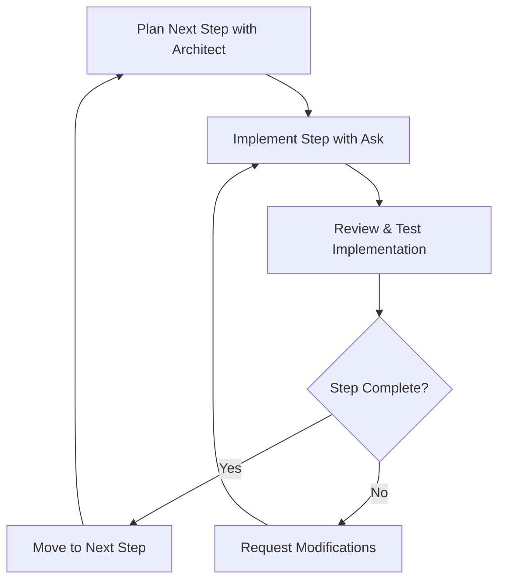

In the previous section, you learned how **Architect** mode helps you plan and strategize your development approach. Now you'll discover how to combine **Architect** and **Ask** modes for iterative development—a powerful approach that keeps you actively involved in the development process while leveraging AI assistance.

## What is Iterative Development?

Iterative development is like building a house room by room instead of trying to construct the entire structure at once. You complete one small, manageable piece, review it, make sure it works correctly, and then move on to the next piece.

Think of it this way: The traditional approach asks for everything at once—"Build me a complete e-commerce website with user authentication, product catalog, shopping cart, and payment processing." The iterative approach breaks this down into manageable pieces—"Let's start by creating a simple product display page, then add the ability to view product details, then implement a basic shopping cart."

## Why Iterative Development Matters

### Maintains Developer Control

When you ask an AI to complete a large, complex task all at once, you often get:
- Code you don't fully understand
- Solutions that don't match your preferences
- Bugs that are difficult to trace
- Features implemented in ways you wouldn't choose

Iterative development keeps you in the driver's seat. You review and approve each step before moving forward.

### Reduces Cognitive Overload

Large AI-generated outputs can be overwhelming. By breaking work into smaller pieces, you can understand each component thoroughly, spot issues early when they're easier to fix, learn from each iteration, and build confidence in the codebase.

### Enables Course Correction

If the AI takes your project in an unexpected direction, you can catch it early and redirect rather than having to refactor large amounts of code.

## How Architect and Ask Modes Work Together

### The Two-Phase Approach

**Phase 1: Strategy with Architect Mode** focuses on defining the overall project vision, breaking down the project into logical phases, identifying dependencies between components, and creating a roadmap for implementation.

**Phase 2: Implementation with Ask Mode** involves requesting one specific step at a time, reviewing and testing each implementation, asking clarifying questions about the approach, and requesting modifications or improvements as needed.

### The Iterative Cycle



## Practical Example: Building a Task Manager

Let's walk through how you might use this approach to build a simple task management application.

### Step 1: Strategic Planning with Architect Mode

**Architect mode prompt:**

```txt
I want to build a simple task management web application using React. The app should allow
users to add tasks, mark them as complete, and delete tasks. I want to build this
iteratively, one feature at a time. Can you help me break this down into manageable steps?
Document them in `INITIAL_STEPS.md`.
```

**Architect mode might respond with a structured plan:** First, set up the basic React project structure to establish your foundation. Next, create a simple task display component to handle individual task presentation. Then add functionality to display a list of hardcoded tasks, followed by implementing the ability to add new tasks. After that, add a task completion toggle feature, implement task deletion capabilities, and finally add basic styling and polish to complete the application.

### Step 2: Implementation with Ask Mode

Now you switch to **Ask** mode and build the project incrementally.

**Ask mode prompt:**

```txt
Based on the plan we created in `INITIAL_STEPS.md`, I want to implement them one step at a time.
Walk me through the process of implementing all of the tasks, one step at a time.

- Do not generate a list of all steps
- Generate one step at a time for me to implement and ask follow-up questions
- Do not show me the next step until I tell you that I am ready for it
```

After reviewing and testing the initial implementation, you continue learning things that still confuse you.

**Second Ask mode prompt:**

```txt
All steps are implemented, however I am still confused about why the form for
adding a task had to be in a separate component than the task list. Can you explain
why this is important?
```

### The Key Difference

Notice how each **Ask** mode prompt requests **one specific step** rather than asking for everything at once. This approach gives you control over the pace, allows you to understand each piece thoroughly, lets you provide feedback and direction throughout the process, and keeps the AI focused on a single, clear objective.

## Best Practices for Iterative Development

### 1. Start Small

Begin with the simplest possible version of each feature. You can always add complexity later.

**Good:** "Create a component that displays a list of three hardcoded tasks"
**Avoid:** "Create a task management system with categories, due dates, priorities, and filtering"

### 2. Test Each Step

Before moving to the next iteration, take time to run the code and verify it works as expected. Check that the implementation matches your expectations, test edge cases if applicable, and make sure you understand how the code functions and why it was implemented that way.

### 3. Ask Clarifying Questions

Don't hesitate to ask **Ask** mode to explain its approach. Questions like "Why did you choose this particular method?", "What are the pros and cons of this approach?", and "How would this scale if we had hundreds of tasks?" help you understand the reasoning behind implementation decisions and learn best practices.

### 4. Request Modifications

If something doesn't feel right, don't hesitate to ask for changes. You might request "Can you refactor this to use a more functional approach?", express preferences like "I'd prefer to use CSS modules instead of inline styles", or ask for simplification with "This component feels too complex—can we break it down further?"

### 5. Document Your Progress

Keep notes about what you've completed, what you learned from each step, decisions you made and why you made them, and what you want to tackle next. This documentation helps you maintain momentum across development sessions and provides valuable context for future decisions.

## Common Pitfalls to Avoid

### The "Just Do Everything" Trap

**Avoid:** "Now implement all the remaining features from our plan"
**Better:** "Let's implement the next feature: adding new tasks"

### Skipping the Review Step

Don't immediately ask for the next feature without understanding the current one. Take time to read through the code carefully, run it in your browser to see how it behaves, experiment with modifications to understand how different parts work together, and ask questions if anything is unclear.

### Over-Planning

While planning is important, don't spend too much time creating elaborate plans. Start with a rough outline and let it evolve as you learn more about your project.

## Exercise: Planning Your Portfolio Site

Now it's time to practice this approach. You'll be building a personal portfolio website using the [Astro framework](https://astro.build/). Astro is a modern web framework that's perfect for content-focused sites like portfolios.

### Setup

- Create a new project directory
- Follow the steps to install RooFlow
- Open the project directory in VS Code
- Activate the memory bank feature of RooFlow

### Your Task

**Start with Architect Mode** by asking it to help you plan a personal portfolio site that includes a homepage with your introduction, an about page with your background, a projects page showcasing your work, and a contact page with your information.

**Break It Down** by working with Architect mode to divide this project into 6-8 manageable steps that build upon each other logically.

**Begin Implementation** by using Ask mode to implement just the first step, focusing on understanding and testing that single piece before moving forward.

> Remember: The goal isn't to complete the entire portfolio in this exercise. Focus on understanding the iterative process and implementing just the first few steps.

## Key Takeaways

Iterative development fundamentally keeps you in control of the development process, ensuring you understand and approve each step before moving forward.

**Architect mode helps you plan** by breaking down complex projects into manageable phases, while

**Ask mode helps you implement** by focusing on one specific step at a time rather than attempting large, complex features all at once.

The success of this approach depends on taking time to review and understand each step before moving to the next, never hesitating to ask questions or request modifications when something doesn't feel right, and testing frequently to catch issues early when they're easier to fix. This methodical approach builds both your understanding of the codebase and your confidence as a developer.
