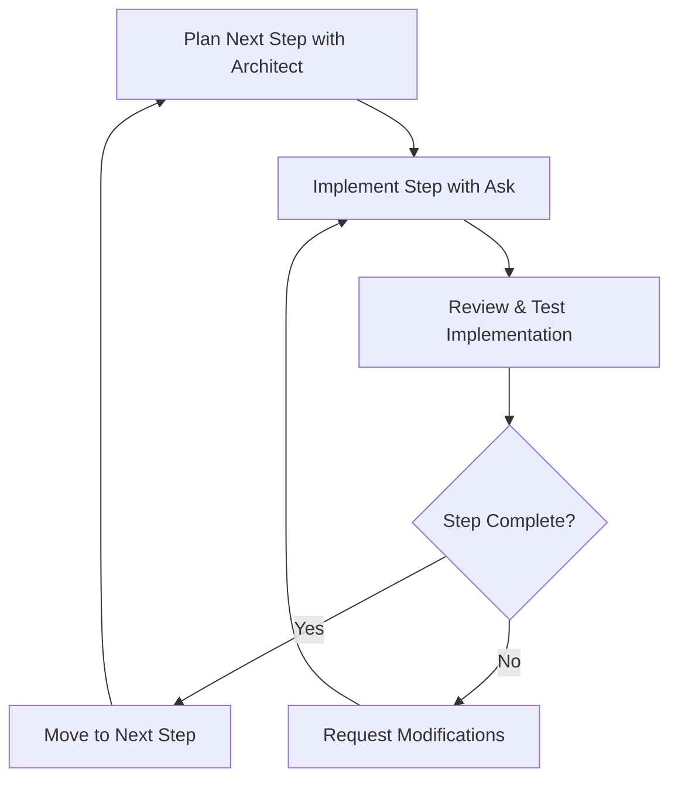

# Iterative Development with Ask Mode

In the previous section, you learned how **Architect** mode helps you plan and strategize your development approach. Now you'll discover how to combine **Architect** and **Ask** modes for iterative development—a powerful approach that keeps you actively involved in the development process while leveraging AI assistance.

## What is Iterative Development?

Iterative development is like building a house room by room instead of trying to construct the entire structure at once. You complete one small, manageable piece, review it, make sure it works correctly, and then move on to the next piece.

Think of it this way:
- **Traditional approach**: "Build me a complete e-commerce website with user authentication, product catalog, shopping cart, and payment processing"
- **Iterative approach**: "Let's start by creating a simple product display page, then add the ability to view product details, then implement a basic shopping cart"

## Why Iterative Development Matters

### Maintains Developer Control

When you ask an AI to complete a large, complex task all at once, you often get:
- Code you don't fully understand
- Solutions that don't match your preferences
- Bugs that are difficult to trace
- Features implemented in ways you wouldn't choose

Iterative development keeps you in the driver's seat. You review and approve each step before moving forward.

### Reduces Cognitive Overload

Large AI-generated outputs can be overwhelming. By breaking work into smaller pieces, you can:
- Understand each component thoroughly
- Spot issues early when they're easier to fix
- Learn from each iteration
- Build confidence in the codebase

### Enables Course Correction

If the AI takes your project in an unexpected direction, you can catch it early and redirect rather than having to refactor large amounts of code.

## How Architect and Ask Modes Work Together

### The Two-Phase Approach

**Phase 1: Strategy with Architect Mode**
- Define the overall project vision
- Break down the project into logical phases
- Identify dependencies between components
- Create a roadmap for implementation

**Phase 2: Implementation with Ask Mode**
- Request one specific step at a time
- Review and test each implementation
- Ask clarifying questions about the approach
- Request modifications or improvements

### The Iterative Cycle



## Practical Example: Building a Task Manager

Let's walk through how you might use this approach to build a simple task management application.

### Step 1: Strategic Planning with Architect Mode

**Your prompt to Architect mode:**
```
I want to build a simple task management web application using React. The app should allow users to add tasks, mark them as complete, and delete tasks. I want to build this iteratively, one feature at a time. Can you help me break this down into manageable steps?
```

**Architect mode might respond with:**
1. Set up basic React project structure
2. Create a simple task display component
3. Add functionality to display a list of hardcoded tasks
4. Implement add new task functionality
5. Add task completion toggle
6. Implement task deletion
7. Add basic styling and polish

### Step 2: Implementation with Ask Mode

Now you switch to **Ask** mode and request one step at a time:

**First Ask mode prompt:**
```
Based on the plan we created, let's start with step 1: Set up the basic React project structure. Please create the initial components and file structure for a task management app, but don't implement any functionality yet—just the skeleton.
```

After reviewing and testing this implementation, you continue:

**Second Ask mode prompt:**
```
Great! The project structure looks good. Now let's move to step 2: Create a simple task display component that shows a single hardcoded task with a title and completion status.
```

### The Key Difference

Notice how each **Ask** mode prompt requests **one specific step** rather than asking for everything at once. This approach:
- Gives you control over the pace
- Allows you to understand each piece
- Lets you provide feedback and direction
- Keeps the AI focused on a single, clear objective

## Best Practices for Iterative Development

### 1. Start Small

Begin with the simplest possible version of each feature. You can always add complexity later.

**Good:** "Create a component that displays a list of three hardcoded tasks"
**Avoid:** "Create a task management system with categories, due dates, priorities, and filtering"

### 2. Test Each Step

Before moving to the next iteration:
- Run the code and verify it works
- Check that it matches your expectations
- Test edge cases if applicable
- Make sure you understand the implementation

### 3. Ask Clarifying Questions

Don't hesitate to ask **Ask** mode to explain its approach:
- "Why did you choose this particular method?"
- "What are the pros and cons of this approach?"
- "How would this scale if we had hundreds of tasks?"

### 4. Request Modifications

If something doesn't feel right, ask for changes:
- "Can you refactor this to use a more functional approach?"
- "I'd prefer to use CSS modules instead of inline styles"
- "This component feels too complex—can we break it down further?"

### 5. Document Your Progress

Keep notes about:
- What you've completed
- What you learned from each step
- Decisions you made and why
- What you want to tackle next

## Common Pitfalls to Avoid

### The "Just Do Everything" Trap

**Avoid:** "Now implement all the remaining features from our plan"
**Better:** "Let's implement the next feature: adding new tasks"

### Skipping the Review Step

Don't immediately ask for the next feature without understanding the current one. Take time to:
- Read through the code
- Run it in your browser
- Experiment with modifications
- Ask questions if anything is unclear

### Over-Planning

While planning is important, don't spend too much time creating elaborate plans. Start with a rough outline and let it evolve as you learn more about your project.

## Exercise: Planning Your Portfolio Site

Now it's time to practice this approach. You'll be building a personal portfolio website using the [Astro framework](https://astro.build/). Astro is a modern web framework that's perfect for content-focused sites like portfolios.

### Your Task

1. **Start with Architect Mode**: Ask Architect mode to help you plan a personal portfolio site that includes:
   - A homepage with your introduction
   - An about page with your background
   - A projects page showcasing your work
   - A contact page with your information

2. **Break It Down**: Work with Architect mode to break this into 6-8 manageable steps

3. **Begin Implementation**: Use Ask mode to implement just the first step

### Getting Started

Open RooCode and switch to **Architect** mode. Here's a sample prompt to get you started:

```
I want to build a personal portfolio website using Astro. The site should showcase my skills as a web developer and include pages for my introduction, background, projects, and contact information. I want to build this iteratively, one piece at a time. Can you help me create a step-by-step plan for building this portfolio site?
```

Remember: The goal isn't to complete the entire portfolio in this exercise. Focus on understanding the iterative process and implementing just the first few steps.

## Key Takeaways

- **Iterative development keeps you in control** of the development process
- **Architect mode helps you plan**, while **Ask mode helps you implement**
- **Request one step at a time** rather than large, complex features
- **Review and understand each step** before moving to the next
- **Don't be afraid to ask questions** or request modifications
- **Test frequently** to catch issues early

In the next chapter, you'll learn how to maintain context across multiple development sessions using RooFlow's Memory Bank feature, ensuring your iterative development process can span multiple work sessions without losing important context.